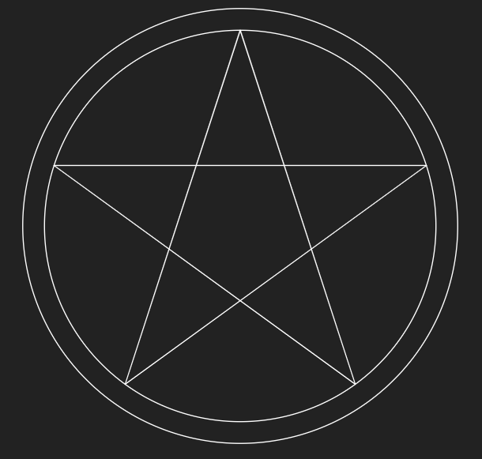
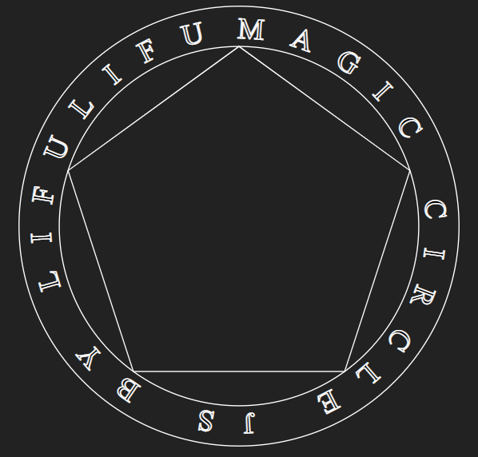
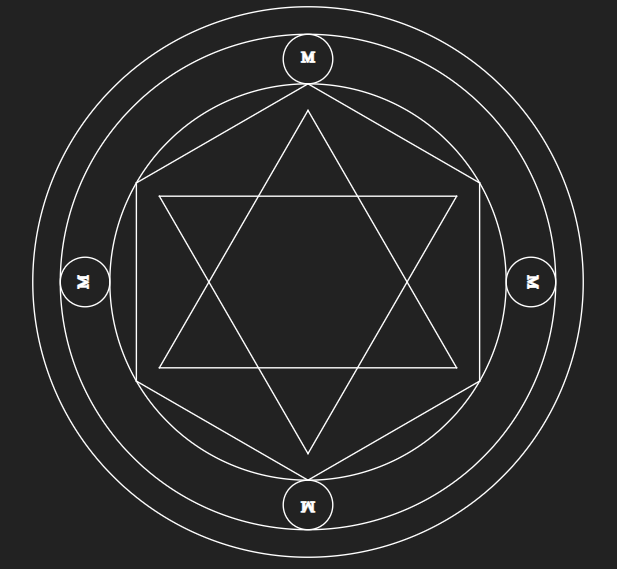

# Magic-js
Draw svg magic circles in JavaScript with ease!  
Demo at https://lifulifu.github.io/Magic-js/UI

## Usage
First, create a MagicCircle instance,
```javascript
let mc = new MagicCircle('container', 200);
```

then add shape to it. Note that shapes are added from outside towards center.
```javascript
mc.add(Shapes.circle({padding: 10}))
  .add(Shapes.circle())
  .add(Shapes.star(5, 2)); // 5 tips with 2-tip gap
```

Render your MagicCircle.
```javascript
mc.draw()
```


## Examples

### custom text
```javascript
mc.add(Shapes.circle({padding: 5}))
  .add(Shapes.circleText('MAGIC CIRCLE JS BY LIFULIFU '))
  .add(Shapes.circle())
  .add(Shapes.polygon(5));
```


### sub-circle
```javascript
let mc = new MagicCircle('container', 200);
let sub = new MagicCircle();

sub.add(Shapes.circle())
   .add(Shapes.text('M'));

mc.add(Shapes.circle({padding: 10}))
  .add(Shapes.circle())
  .add(Shapes.chain([sub, sub, sub, sub]))
  .add(Shapes.circle())
  .add(Shapes.polygon(6))
  .add(Shapes.star(6, 2));
```

